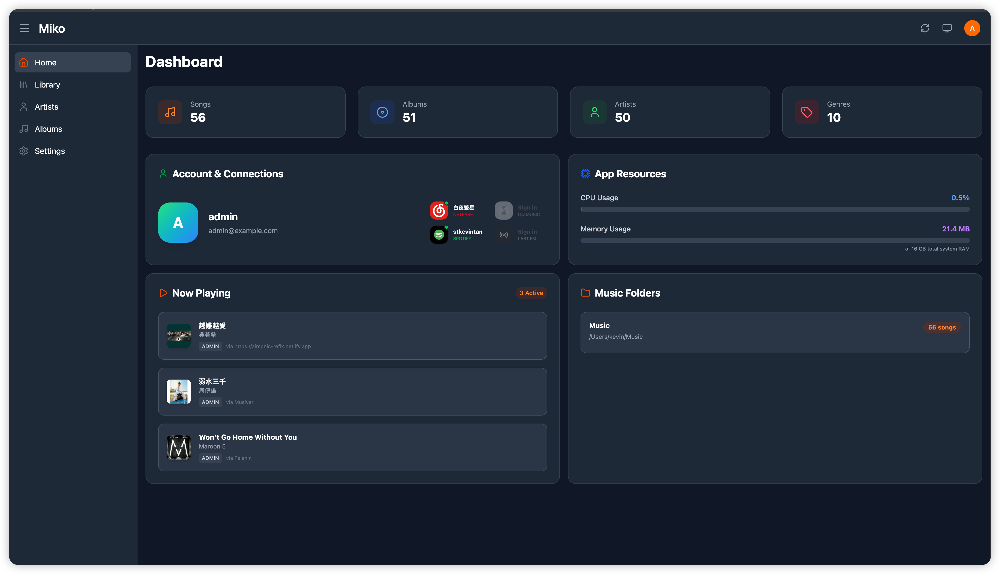

# miko-rs
[](https://github.com/stkevintan/miko.rs/actions/workflows/docker-publish.yml)


A lightweight, high-performance Subsonic-compatible music server written in Rust.



## Features

- 🚀 **High Performance & Tiny Footprint**: Built with Rust for maximum efficiency.
- 🎨 **Modern Web UI**: Fascinating web-based dashboard and control panel for easy management.
- ☁️ **Online Music Integration**: Support for online music (downloader/scraper) via extensions (TODO).
- 📻 **Subsonic & OpenSubsonic**: Fully compatible and tested with clients like Feishin, Airsonic, Submariner, Musiver (音流), and Amcfy Music (箭头音乐).
- 💻 **Cross-Platform**: Run it anywhere—supports multiple operating systems (Linux, macOS, Windows) and architectures (ARM64, x86_64, etc.).

### Subsonic API Implementation Status

This project implements the Subsonic API (version 1.16.1) to support various music clients (e.g., Symfonium, Dsub, Amuse).

- **System**
  - [x] `ping`
  - [x] `getLicense`
  - [x] `getOpenSubsonicExtensions`
- **Browsing**
  - [x] `getMusicFolders`
  - [x] `getIndexes`
  - [x] `getMusicDirectory`
  - [x] `getGenres`
  - [x] `getArtists`
  - [x] `getArtist`
  - [x] `getAlbum`
  - [x] `getSong`
  - [x] `getArtistInfo`
  - [x] `getArtistInfo2`
  - [x] `getAlbumInfo`
  - [x] `getAlbumInfo2`
  - [x] `getSimilarSongs`
  - [x] `getSimilarSongs2`
  - [x] `getTopSongs`
  - [ ] `getVideos`
  - [ ] `getVideoInfo`
- **Media Retrieval**
  - [x] `stream`
  - [x] `download`
  - [x] `getCoverArt`
  - [x] `getLyrics`
  - [x] `getLyricsBySongId`
  - [x] `getAvatar`
  - [ ] `hls.m3u8`
  - [ ] `getCaptions`
- **Playlists**
  - [x] `getPlaylists`
  - [x] `getPlaylist`
  - [x] `createPlaylist`
  - [x] `updatePlaylist`
  - [x] `deletePlaylist`
- **Scanning**
  - [x] `getScanStatus`
  - [x] `startScan`
- **Searching**
  - [x] `search`
  - [x] `search2`
  - [x] `search3`
- **User Management**
  - [x] `getUser`
  - [x] `getUsers`
  - [x] `createUser`
  - [x] `updateUser`
  - [x] `deleteUser`
  - [ ] `changePassword`
- **Lists**
  - [x] `getAlbumList`
  - [x] `getAlbumList2`
  - [x] `getRandomSongs`
  - [x] `getSongsByGenre`
  - [x] `getNowPlaying`
  - [x] `getStarred`
  - [x] `getStarred2`
- **Annotation**
  - [x] `star`
  - [x] `unstar`
  - [x] `setRating`
  - [x] `scrobble`
- **Bookmarks**
  - [x] `getBookmarks`
  - [x] `createBookmark`
  - [x] `deleteBookmark`
  - [x] `getPlayQueue`
  - [x] `savePlayQueue`
- **Chat**
  - [ ] `getChatMessages`
  - [ ] `addChatMessage`

### OpenSubsonic Extensions
- **Multi-Artist Support**: For songs and albums, an `artists` field is included in the response. This field provides a structured list of all artists associated with the item, which is particularly useful for tracks with multiple contributors.
    - Format: `artists: [{"id": "artist_id", "name": "Artist Name"}, ...]`
- **Extended Lyrics**: Supports `getLyricsBySongId` for better lyrics compatibility with modern clients.
- **Incremental Scanning**: `startScan` is incremental by default. It only scans for new or modified files.
    - To trigger a full re-scan, append `fullScan=true` to the request.

---

## Installation

### Prerequisites
- Docker and Docker Compose installed on your system.
- A directory containing your music collection.

### Using Docker Compose (Recommended)

The easiest way to run `miko-rs` is using Docker Compose. Create a `docker-compose.yml` file with the following content:

```yaml
services:
  miko-rs:
    image: ghcr.io/stkevintan/miko.rs:latest
    container_name: miko-rs
    restart: unless-stopped
    ports:
      - "8081:8081"
    environment:
      - PORT=8081
      - DATABASE_URL=sqlite:///app/data/miko.db
      - SUBSONIC_DATA_DIR=/app/data
      - JWT_SECRET=your_secret_key_here
      - PASSWORD_SECRET=your_password_salt_here
    volumes:
      - ./data:/app/data
      - /path/to/your/music:/music:ro
```

#### Configuration
- **PORT**: The port the server will listen on inside the container (default: `8081`).
- **DATABASE_URL**: Path to the SQLite database file (e.g., `sqlite:///app/data/miko.db`).
- **SUBSONIC_DATA_DIR**: Folder where the server stores application data (e.g., `/app/data`).
- **JWT_SECRET**: A secret string for signing JWT tokens.
- **PASSWORD_SECRET**: A secret string used as a salt for password hashing.
- **Volumes**:
    - `/app/data`: Stores the SQLite database and search indexes.
    - `/music`: Map your local music directory to this path (read-only recommended).

### Running with Docker

You can also run it directly using the Docker CLI:

```bash
docker run -d \
  --name miko-rs \
  -p 8081:8081 \
  -e JWT_SECRET=mysecret \
  -e PASSWORD_SECRET=mysalt \
  -e SUBSONIC_DATA_DIR=/app/data \
  -v $(pwd)/data:/app/data \
  -v /path/to/your/music:/music:ro \
  ghcr.io/stkevintan/miko.rs:latest
```

Once the service is running, access the Web UI at `http://<your-server-ip>:8081` to configure your music folders and user accounts.

**Default Credentials:**
- **Username**: `admin`
- **Password**: `adminpassword`

> [!WARNING]
> For security reasons, it is strongly recommended to change the default password immediately after your first login.

The subsonic service will also be available at the same endpoint.

---

## Development

### Prerequisites
- [Rust](https://www.rust-lang.org/) (latest stable)
- [Node.js](https://nodejs.org/) (>=20)
- [pnpm](https://pnpm.io/) (>=10)
- [Sea-ORM CLI](https://www.sea-ql.org/SeaORM/docs/install-and-config/sea-orm-cli/) (optional, for migrations)

### Setup

1. **Clone the repository**:
   ```bash
   git clone https://github.com/stkevintan/miko-rs
   cd miko-rs
   ```

2. **Configure Environment**:
   Create a `.env` file in the root directory:
   ```dotenv
   DATABASE_URL=sqlite://miko.db?mode=rwc
   PORT=3334
   PASSWORD_SECRET=your-32-character-secret-here
   JWT_SECRET=your-32-character-secret-here
   SUBSONIC_DATA_DIR=./data
   ```

3. **Install Frontend Dependencies**:
   ```bash
   pnpm install
   ```

### Running Locally

To develop with hot-reloading for the frontend and automatic proxying to the backend:

1. **Start the Backend**:
   ```bash
   cargo run
   ```
   The backend will start on `http://localhost:3334`.

2. **Start the Frontend (Dev Mode)**:
   ```bash
   pnpm dev
   ```
   The frontend will be available at `http://localhost:8081`. It is configured to proxy `/api` and `/rest` requests to your local backend.

### Production Build

To build the project for production (embedding the frontend into the Rust binary):

1. **Build the Frontend**:
   ```bash
   pnpm build
   ```
   This generates the static files in the `dist/` directory.

2. **Build the Backend**:
   ```bash
   cargo build --release
   ```
   The static files from `dist/` are embedded into the resulting binary using `rust-embed`.

### Multi-Platform Build
A helper script is provided for cross-platform builds:

```bash
./scripts/build.sh
```
